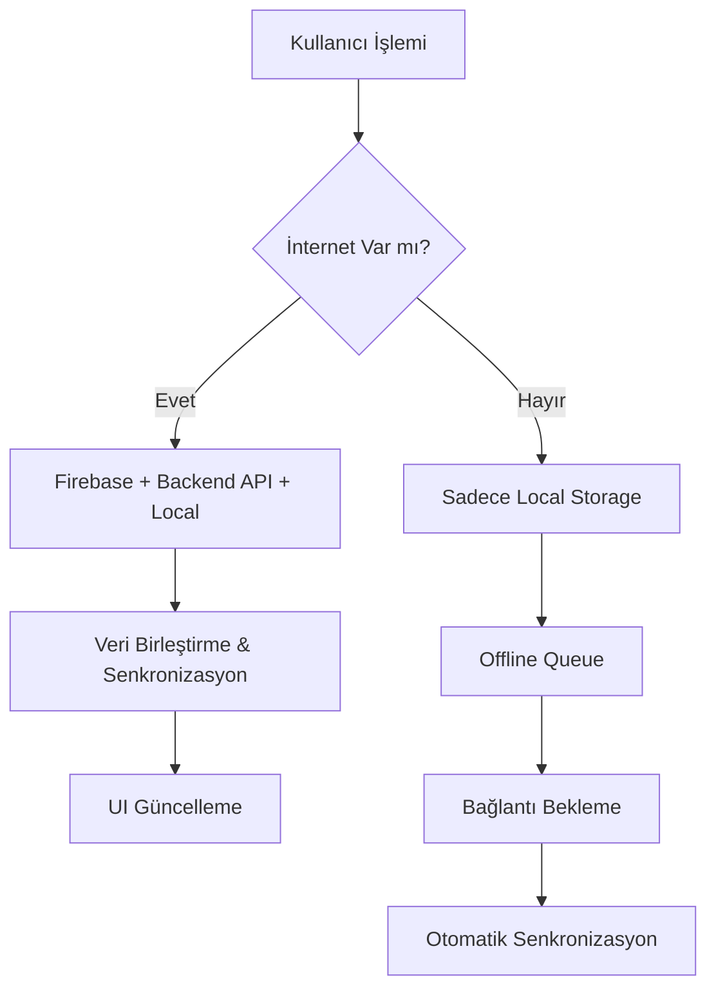

# 📝 Connectino Case - Not Uygulaması

Modern, çok platformlu bir not alma uygulaması. Firebase, Backend API ve Local Storage ile tam senkronizasyon desteği sunan hibrit mimari.

## 🚀 Proje Özeti

Connectino Case, kullanıcıların notlarını oluşturmasına, düzenlemesine ve senkronize etmesine olanak tanıyan kapsamlı bir not uygulamasıdır. Uygulama, **Flutter** ile geliştirilmiş mobil frontend ve **FastAPI** ile geliştirilmiş backend API'den oluşmaktadır.

### ✨ Temel Özellikler

- **📱 Çok Platformlu**: iOS, Android ve Web desteği
- **☁️ Bulut Senkronizasyonu**: Firebase Firestore entegrasyonu
- **🔄 Offline Desteği**: İnternet bağlantısı olmadan çalışma
- **🔐 Güvenli Authentication**: Firebase Auth ile kullanıcı yönetimi
- **📌 Pin/Unpin**: Önemli notları sabitleme
- **🔍 Arama**: Hızlı not arama özelliği
- **🎨 Modern UI**: Material Design 3 ile güzel arayüz

## 🏗️ Proje Mimarisi

### 📁 Proje Yapısı
```
Connectino Case/
├── 📱 my_notes/           # Flutter Mobil Uygulama
│   ├── lib/
│   │   ├── models/        # Veri modelleri
│   │   ├── services/      # API, Firebase, Local Storage servisleri
│   │   ├── providers/     # State management (Provider)
│   │   ├── pages/         # UI sayfaları
│   │   └── widgets/       # Yeniden kullanılabilir bileşenler
│   ├── android/           # Android platform dosyaları
│   ├── ios/               # iOS platform dosyaları
│   └── web/               # Web platform dosyaları
├── 🔧 backend/            # FastAPI Backend
│   ├── main.py            # Ana API dosyası
│   ├── requirements.txt   # Python bağımlılıkları
│   └── notes.db           # SQLite veritabanı
└── 📚 docs/               # Proje dokümantasyonu
```

### 🔄 Senkronizasyon Stratejisi



## 🛠️ Teknoloji Stack'i

### 📱 Frontend (Flutter)
- **Framework**: Flutter 3.x
- **Language**: Dart 3.x
- **State Management**: Provider
- **UI Framework**: Material Design 3
- **Local Database**: Isar (NoSQL)
- **HTTP Client**: http package

### ☁️ Cloud & Database
- **Authentication**: Firebase Auth
- **Cloud Database**: Firebase Firestore
- **Real-time Sync**: Firestore Streams
- **Offline Support**: Isar Local Storage

### 🔧 Backend (FastAPI)
- **Framework**: FastAPI
- **Language**: Python 3.8+
- **Database**: SQLite + SQLAlchemy ORM
- **Validation**: Pydantic
- **Documentation**: Auto-generated Swagger/ReDoc

## 🚀 Hızlı Başlangıç

### Gereksinimler
- **Flutter SDK** 3.x+
- **Dart SDK** 3.x+
- **Python** 3.8+
- **Firebase Projesi**
- **Git**

### 1. Projeyi Klonlayın
```bash
git clone https://github.com/VolkanCARBUGA/Connectino-Case.git
cd "Connectino Case"
```

### 2. Backend Kurulumu
```bash
cd backend

# Virtual environment oluşturun
python -m venv myenv

# Virtual environment'ı aktifleştirin
# macOS/Linux:
source myenv/bin/activate
# Windows:
myenv\Scripts\activate

# Bağımlılıkları yükleyin
pip install -r requirements.txt

# Environment variables ayarlayın
echo "DATABASE_URL=sqlite:///./notes.db" > .env

# Backend'i başlatın
uvicorn main:app --reload
```

Backend şu adreste çalışacak: `http://localhost:8000`
- **API Docs**: http://localhost:8000/docs
- **ReDoc**: http://localhost:8000/redoc

### 3. Mobil Uygulama Kurulumu
```bash
cd my_notes

# Bağımlılıkları yükleyin
flutter pub get

# Firebase konfigürasyonu
cp env.example .env
# .env dosyasını Firebase bilgilerinizle düzenleyin

# Uygulamayı çalıştırın
flutter run
```

## 📱 Mobil Uygulama Detayları

### 🔐 Authentication
- **Firebase Auth** ile email/şifre girişi
- **Kayıt olma** ve **giriş yapma** sayfaları
- **Otomatik oturum yönetimi**

### 📝 Not Yönetimi
- **Not oluşturma**: Başlık ve içerik ile
- **Not düzenleme**: In-place düzenleme
- **Not silme**: Geri alma özelliği ile
- **Pin/Unpin**: Önemli notları sabitleme
- **Arama**: Başlık ve içerikte arama

### 🔄 Senkronizasyon Özellikleri
- **Online**: Firebase + Backend API + Local
- **Offline**: Sadece Local Storage
- **Otomatik Sync**: İnternet bağlantısı geldiğinde
- **Conflict Resolution**: Son yazma kazanır stratejisi

### 📊 Veri Modeli
```dart
class NoteModel {
  Id id;                    // Benzersiz ID
  String title;             // Not başlığı
  String content;           // Not içeriği
  bool isPinned;            // Sabitlenmiş mi?
  String userId;            // Kullanıcı ID'si
  DateTime createdAt;       // Oluşturulma tarihi
  DateTime? updatedAt;      // Güncellenme tarihi
}
```

## 🔧 Backend API Detayları

### 📡 API Endpoints

#### Base URL: `http://localhost:8000`

| Method | Endpoint | Açıklama |
|--------|----------|----------|
| GET | `/notes` | Tüm notları getir |
| POST | `/notes` | Yeni not oluştur |
| GET | `/notes/{id}` | Belirli notu getir |
| PUT | `/notes/{id}` | Notu güncelle |
| DELETE | `/notes/{id}` | Notu sil |

### 📋 API Örnekleri

#### Yeni Not Oluştur
```bash
curl -X POST "http://localhost:8000/notes" \
  -H "Content-Type: application/json" \
  -d '{
    "title": "Örnek Not",
    "content": "Bu bir örnek nottur"
  }'
```

#### Tüm Notları Getir
```bash
curl -X GET "http://localhost:8000/notes"
```

#### Notu Güncelle
```bash
curl -X PUT "http://localhost:8000/notes/1" \
  -H "Content-Type: application/json" \
  -d '{
    "title": "Güncellenmiş Başlık",
    "isPinned": true
  }'
```

### 📊 Veritabanı Şeması

```sql
CREATE TABLE notes (
    id INTEGER PRIMARY KEY AUTOINCREMENT,
    title VARCHAR NOT NULL,
    content TEXT NOT NULL,
    isPinned BOOLEAN DEFAULT FALSE,
    created_at DATETIME DEFAULT CURRENT_TIMESTAMP,
    updated_at DATETIME DEFAULT CURRENT_TIMESTAMP
);
```

## 🔄 Senkronizasyon Detayları

### Online Mod (İnternet Bağlantısı Var)
1. **Not Ekleme**: Local → Firebase → Backend API → Local Refresh
2. **Not Güncelleme**: Firebase → Backend API → Local
3. **Not Silme**: Firebase → Backend API → Local
4. **Veri Getirme**: Firebase + Backend API → Merge → Local

### Offline Mod (İnternet Bağlantısı Yok)
1. **Tüm İşlemler**: Sadece Local Storage
2. **Queue Sistemi**: İşlemler sıraya alınır
3. **Otomatik Sync**: Bağlantı geldiğinde senkronize edilir

### Conflict Resolution
- **Son Yazma Kazanır**: En son güncellenen veri korunur
- **Timestamp Kontrolü**: `updatedAt` alanına göre karar verilir
- **Kullanıcı Bildirimi**: Çakışma durumunda kullanıcı bilgilendirilir

## 🔧 Geliştirme Rehberi


### Backend Geliştirme
```bash
# API dokümantasyonu
# http://localhost:8000/docs

# Test
curl -X GET "http://localhost:8000/notes"

# Log takibi
uvicorn main:app --reload --log-level debug
```

### Firebase Kurulumu
1. [Firebase Console](https://console.firebase.google.com/)'da proje oluşturun
2. **Firestore Database**'i etkinleştirin
3. **Authentication**'ı etkinleştirin
4. **google-services.json** (Android) ve **GoogleService-Info.plist** (iOS) dosyalarını ekleyin

## 🚨 Hata Yönetimi

### Mobil Uygulama
- **Retry Mekanizması**: Firebase işlemleri için 3 deneme
- **Offline Detection**: Connectivity Plus ile bağlantı kontrolü
- **User Feedback**: SnackBar ile kullanıcı bilgilendirmesi
- **Error Logging**: Debug modda detaylı log

### Backend API
- **HTTP Status Codes**: RESTful standartlara uygun
- **Validation Errors**: Pydantic ile input validasyonu
- **Database Errors**: SQLAlchemy hata yönetimi
- **API Documentation**: Otomatik Swagger dokümantasyonu

## 📱 Platform Desteği

| Platform | Durum | Notlar |
|----------|-------|--------|
| **Android** | ✅ Tam Destek | API 21+ |
| **iOS** | ✅ Tam Destek | iOS 11+ |


## 🔒 Güvenlik

### Mobil Uygulama
- **Firebase Security Rules**: Firestore güvenlik kuralları
- **Local Encryption**: Isar ile şifrelenmiş local storage
- **Token Management**: Firebase Auth token yönetimi


## 📊 Performans

### Mobil Uygulama
- **Lazy Loading**: Notlar sayfa sayfa yüklenir
- **Image Caching**: Yerel görsel önbelleği
- **Memory Management**: Efficient widget lifecycle
- **Background Sync**: Arka plan senkronizasyonu

### Backend API
- **Connection Pooling**: SQLAlchemy connection pool
- **Response Caching**: HTTP cache headers
- **Database Indexing**: Optimized queries
- **Async Operations**: FastAPI async/await


## 📹 Demo Videoları

### 🎬 Ana Demo Videosu
**Connectino Case - Tam Özellik Tanıtımı**

#### 📱 İzlenebilir Demo Video
**🎥 Connectino Case Demo Video - Tam Özellik Tanıtımı**


**Video İçeriği:**
- 📱 Mobil uygulama kullanımı
- 🔐 Kullanıcı girişi ve kayıt olma
- 📝 Not oluşturma, düzenleme ve silme
- 🔄 Offline senkronizasyon
- 🔍 Arama ve filtreleme özellikleri
- 📌 Pin/unpin işlemleri
- 🌐 Web uygulaması gösterimi

> **Not**: Video yukarıda otomatik olarak oynatılabilir şekilde görüntülenecektir. İndirme yapmanıza gerek yoktur.

