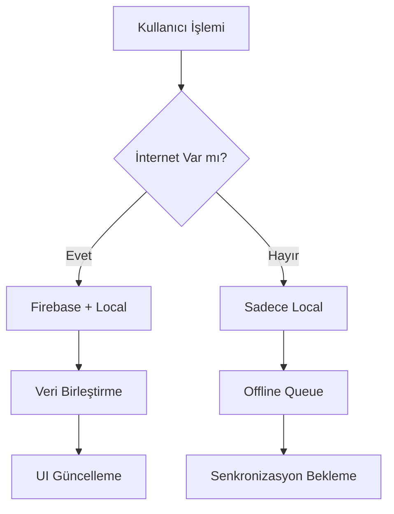

# 📝 My Notes - Flutter Not Uygulaması

Modern, çok platformlu bir not alma uygulaması. Firebase, Backend API ve Local Storage ile tam senkronizasyon desteği.

## 🚀 Özellikler

### ✨ Temel Özellikler
- **Not Oluşturma**: Başlık ve içerik ile notlar oluşturun
- **Not Düzenleme**: Mevcut notları düzenleyin
- **Not Silme**: Notları silin (geri alma özelliği ile)
- **Pin/Unpin**: Önemli notları sabitleyin
- **Arama**: Notlarınızda hızlı arama yapın
- **Sıralama**: Pinli notlar üstte, sonra tarihe göre sıralama

### 🔄 Senkronizasyon
- **Firebase**: Bulut senkronizasyonu
- **Local Storage**: Offline çalışma desteği
- **Çoklu Platform**: Tüm veriler platformlar arası senkronize

### 🎨 Kullanıcı Arayüzü
- **Modern Tasarım**: Material Design 3
- **Responsive**: Tüm ekran boyutlarına uyumlu

## 🏗️ Mimari

### 📁 Proje Yapısı
```
lib/
├── models/           # Veri modelleri
│   ├── note_model.dart
│   └── note_model.g.dart
├── services/         # Servis katmanı
│   ├── api_services.dart
│   ├── connectivity_service.dart
│   ├── firebase_services.dart
│   └── local_storage_service.dart
├── providers/        # State management
│   ├── auth_provider.dart
│   └── notes_provider.dart
├── pages/           # Sayfalar
│   ├── auth/
│   │   ├── login_page.dart
│   │   └── register_page.dart
│   ├── notes_page.dart
│   └── create_note.dart
├── widgets/         # Yeniden kullanılabilir widget'lar
│   ├── button_widget.dart
│   ├── info_container.dart
│   ├── input_widget.dart
│   ├── note_item.dart
│   └── search_bar.dart
├── firebase_options.dart  # Firebase konfigürasyonu
└── main.dart        # Uygulama giriş noktası
```


### 🔧 Teknoloji Stack'i

#### Frontend (Flutter)
- **Flutter**: 3.x
- **Dart**: 3.x
- **Provider**: State management
- **Material Design 3**: UI framework

#### Database & Cloud
- **Firebase Firestore**: NoSQL cloud database
- **Firebase Auth**: Authentication
- **Isar**: Local NoSQL database

## 📊 Veri Akışı

### 🔄 Senkronizasyon Stratejisi


### 📝 Not Modeli
```dart
class NoteModel {
  Id id;                    // Benzersiz ID
  String title;             // Not başlığı
  String content;           // Not içeriği
  bool isPinned;            // Sabitlenmiş mi?
  String userId;            // Kullanıcı ID'si
  DateTime createdAt;       // Oluşturulma tarihi
  DateTime? updatedAt;      // Güncellenme tarihi
}
```

## 🛠️ Kurulum

### Gereksinimler
- Flutter SDK 3.x+
- Dart SDK 3.x+
- Firebase projesi
- Git

### 1. Projeyi Klonlayın
```bash
git clone https://github.com/VolkanCARBUGA/Connectino-Case.git
cd my_notes
```

### 2. Environment Variables Ayarlayın
```bash
# .env dosyası oluşturun
cp env.example .env

# .env dosyasını düzenleyin (Firebase ve Backend bilgilerinizi girin)
nano .env
```

### 3. Flutter Bağımlılıklarını Yükleyin
```bash
flutter pub get
```

### 4. Firebase Kurulumu
1. Firebase Console'da yeni proje oluşturun
2. Firestore Database'i etkinleştirin
3. Authentication'ı etkinleştirin
4. `google-services.json` (Android) ve `GoogleService-Info.plist` (iOS) dosyalarını ekleyin

### 5. Uygulamayı Çalıştırın
```bash
flutter run
```

## 🔧 Konfigürasyon

### Firebase Konfigürasyonu
```dart
// lib/main.dart
void main() async {
  WidgetsFlutterBinding.ensureInitialized();
  await Firebase.initializeApp();
  runApp(MyApp());
}
```

### Environment Variables
```bash
# .env dosyası oluşturun (env.example'dan kopyalayın)
cp env.example .env

# .env dosyasını düzenleyin (Firebase bilgilerinizi girin)
FIREBASE_API_KEY=your_firebase_api_key
# ... diğer değişkenler
```

## 📱 Kullanım

### Not Oluşturma
1. Ana sayfada "+" butonuna tıklayın
2. Başlık ve içerik girin
3. "Kaydet" butonuna tıklayın
4. Not otomatik olarak tüm platformlara senkronize edilir

### Not Düzenleme
1. Düzenlemek istediğiniz notu seçin
2. İçeriği değiştirin
3. Değişiklikler otomatik kaydedilir

### Not Sabitleme
1. Notun yanındaki pin ikonuna tıklayın
2. Sabitlenen notlar listenin üstünde görünür
3. Pin durumu tüm platformlarda senkronize edilir

### Arama
1. Arama çubuğuna arama terimi girin
2. Sonuçlar gerçek zamanlı olarak filtrelenir
3. Arama başlık ve içerikte yapılır

## 🔄 Senkronizasyon Detayları

### Veri Akışı
1. **Kullanıcı İşlemi**: Not oluşturma/düzenleme/silme
2. **Local Storage**: İşlem önce local'e kaydedilir
3. **Firebase Sync**: İnternet varsa Firebase'e senkronize edilir
4. **Veri Birleştirme**: Tüm kaynaklardan veriler birleştirilir

### Offline Desteği
- İnternet yokken notlar local storage'da saklanır
- İnternet geldiğinde otomatik senkronizasyon
- Çakışma durumunda son değişiklik öncelikli

### Hata Yönetimi
- Retry mekanizması (3 deneme)
- Kullanıcı dostu hata mesajları
- Offline durumu bildirimi


---

**Not**: Bu uygulama eğitim amaçlı geliştirilmiştir. Production kullanımı için ek güvenlik önlemleri alınması önerilir.
